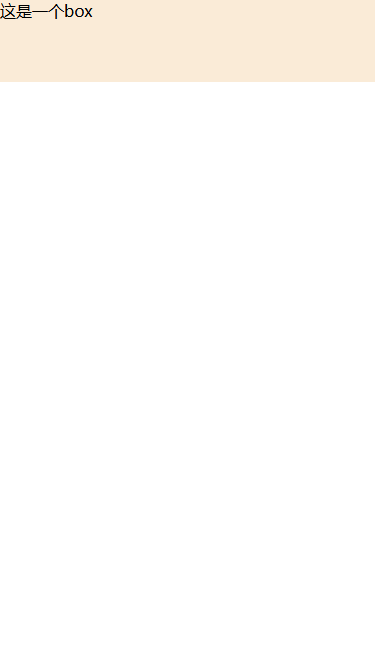

::: info rem 的计算公式
h5 的项目中，我们要实现盒子模型的自动适配，我们可以通过 rem 来实现。主要思路就是通过 js 来动态的设置 html 的字体大小，然后通过 rem 来控制其他元素的尺寸。

下面是一个简单的例子：

:::

````css
*{
  padding: 0;
  margin: 0;
}
html{
  font-size: 100px;
  overflow: hidden;
}
.box{
  width: 7.5rem;
  height: 1.64rem;
  background-color: antiquewhite;
  font-size: .32rem;
  margin:0 auto;
  max-width:7.5rem;
  min-width: 3.2rem;
}

```
再通过 js 来动态的设置 html 的字体大小，代码如下：

```js
(function () {
  console.log(123);
  const computed = () => {
    const html = document.documentElement;
    let deviceWidth = html.clientWidth || document.body.clientWidth;
    if (deviceWidth > 750) {
      deviceWidth = 750;
    } else if (deviceWidth < 320) {
      deviceWidth = 320;
    }
    const designWidth = 750;
    let ratio = (deviceWidth * 100) / designWidth;
    html.style.fontSize = ratio + "px";
  };
  computed();

  window.addEventListener("resize", computed);
})();

````

## 总结


